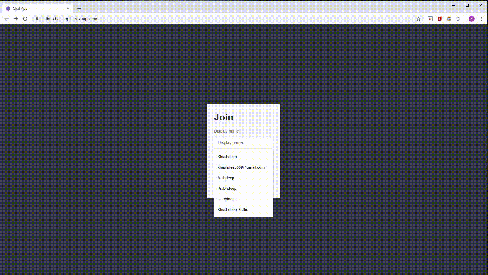
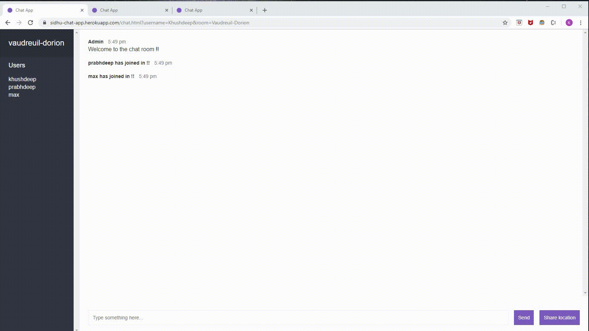
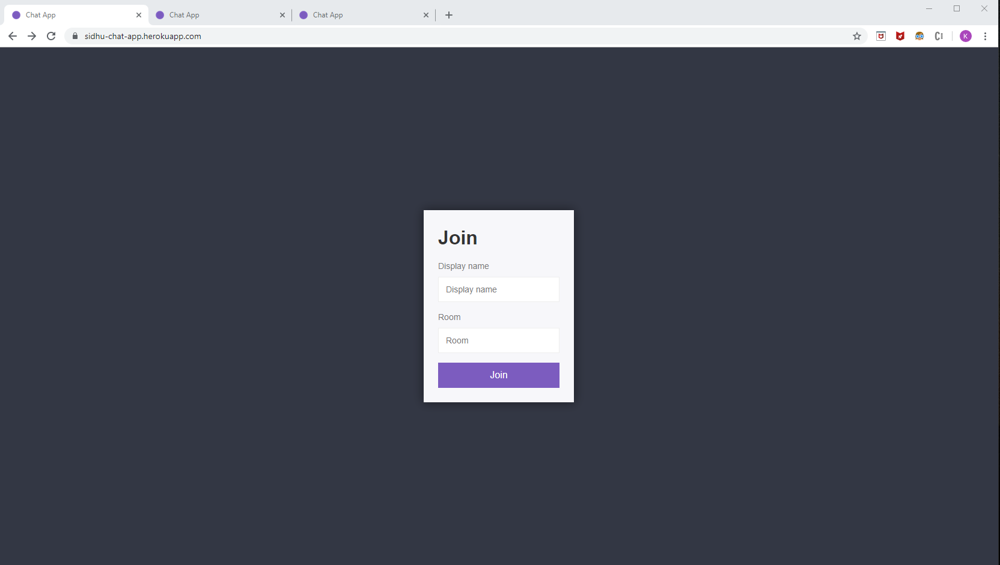
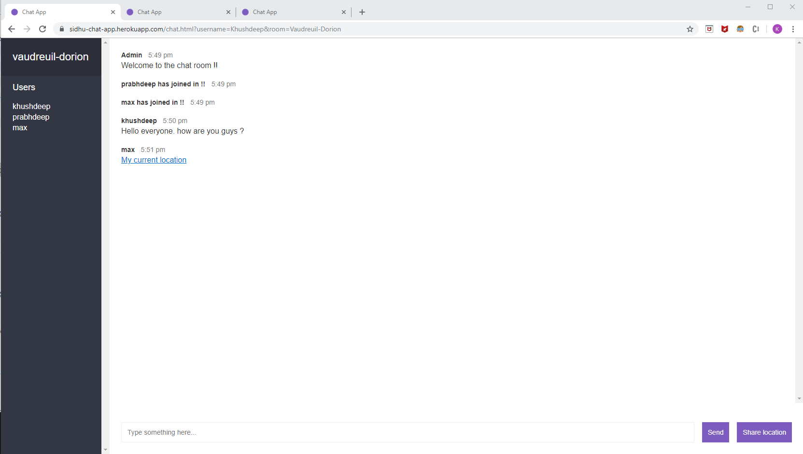

# Web Sockets based Chat App

A real time chat application based on Node, Express, WebSocket protocol and Socket.io.

## Features

1.	This project is built on top of WebSocket protocol which supports real-time bi-direction communication.
2.	Socket.io library is used to setup a WebSocket server using Node/Express.
3.	Browser supported Geolocation API is used to share the user’s location.
4.	Bad-words module is used to check if a chat message contains profane language.

## Live Demo

### Join and leave chat room



### Send chat message and share location



## Screenshots

### Join Page



### Chat Page



## Build Setup

```
# Clone project
git clone https://github.com/KhushdeepSidhu/chat-app.git

# install the packages with npm or yarn
cd chat-app
npm install 
# or yarn 
yarn install 

## development
npm run dev
# or yarn
yarn dev

## production
npm run start
# or yarn
yarn run start
```
App is deployed on Heroku production environment. App can be accessed on this url - https://sidhu-chat-app.herokuapp.com/
